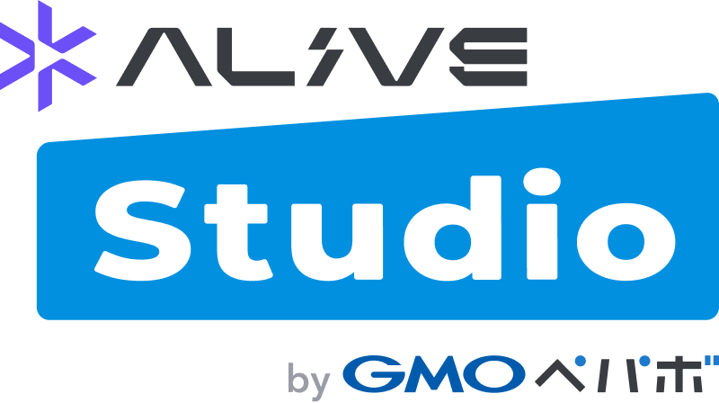

# 🎬 OBSプラグイン集（提供：Alive Project byGMOペパボ）

このリポジトリでは、[Alive Project byGMOペパボ](https://alive-project.com/)が提供する、OBSをもっと便利に使える配信支援ツールを公開しています。

## 🛠️ スクリプト一覧

- [ドット絵フィルター](./scripts/halftone-dot-filter/README.md) - 映像をドット絵に変換
- [モザイクフィルター](./scripts/mosaic-filter/README.md) - 映像にモザイクをかける
- [角丸フィルター](./scripts/rounded-corner-filter/README.md) - 映像に角丸効果を追加
- [アニメーション](./scripts/animation-filter/README.md) - 映像にアニメーションを追加
- [顔ハメパネル](./scripts/face-hole-filter/README.md) - 映像に顔ハメパネルを追加
- [回転フィルター](./scripts/rotation-filter/README.md) - 映像を回転させる
- [3D回転フィルター](./scripts/3drotation-filter/README.md) - 映像を3D的に回転させる
- [アニメーションフレーム](./scripts/animation-frame-filter/README.md) - 映像にアニメーションフレームを追加
- [トランジションフィルター](./scripts/transition-filter/README.md) - 映像にトランジション効果を追加
- [フィルムカメラフィルター](./scripts/film-camera-filter/README.md) - 映像にフィルムカメラのような質感を追加
- [スポットライト](./scripts/spotlight-filter/README.md) - 映像にスポットライトを追加
- [振り子フィルター](./scripts/pendulum-filter/README.md) - 映像を振り子のように揺らす
- [ピンフィルター](./scripts/pin-filter/README.md) - 映像にピン型のフィルターを追加
- [水中効果フィルター](./scripts/water-immersion-filter/README.md) - 映像に水中効果を追加
- [ポップアウトワイプフィルター](./scripts/popout-wipe-filter/README.md) - 映像にポップアウトワイプ効果を追加
- [影フィルター](./scripts/drop-shadow-filter/README.md) - 映像に影を追加
- [ルーペフィルター](https://raw.githubusercontent.com/pepabo/alive-project-obs-plugins/main/scripts/magnifier-filter/magnifier-filter.lua) - 映像にルーペを追加

使い方については、各スクリプトのREADMEをご覧ください。

## 🔗 関連ツール

- [Alive Studio byGMOペパボ](https://alive-project.com/studio) - 配信画面デザインサービス
- [OBS Studio](https://obsproject.com/) - 配信・録画ソフト

## 📝 ライセンス

本リポジトリのソフトウェアはMITライセンスのもとで公開されています。利用に際して生じたいかなる問題についても、開発元は一切の責任を負いません。詳しくは[LICENSE](./LICENSE)をご確認ください。

## 🎯 提供

© 2025 GMO Pepabo, Inc. All rights reserved.
