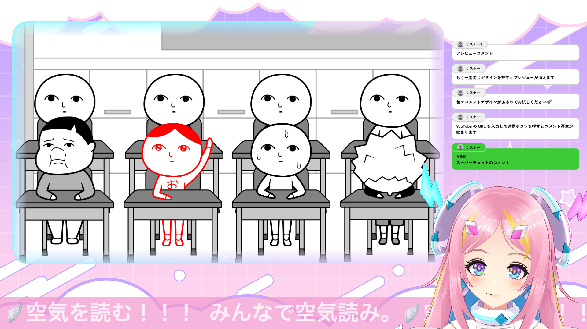

# 🎨 アニメーションフレーム

映像ソースに装飾的なフレーム効果を適用できるフィルターです。角丸と様々なアニメーションスタイルで配信画面をよりスタイリッシュに演出できます。

## 🎥 使用例

## 🔧 インストール方法

1. [`animation-frame-filter.lua`](https://raw.githubusercontent.com/pepabo/alive-project-obs-plugins/main/scripts/animation-frame-filter/animation-frame-filter.lua)をダウンロード

    - リンクを右クリックして、「リンク先を別名で保存」を選択するとダウンロードできます。

2. OBSメニューの「ツール」→「スクリプト」を選択
3. 「+」ボタンをクリックし、ダウンロードした「animation-frame-filter.lua」を選択
4. 「有効なプロパティがありません」と表示されますが、これは正常です

## 🎬 フィルター適用方法

1. シーンまたはソースを右クリック→「フィルター」を選択
2. 「+」ボタンをクリック→「アニメーションフレーム」を選択
3. フィルターの設定を調整

このフィルターは映像に装飾的なフレームを追加し、角丸効果も併せて適用します。

## ⚙️ 設定項目

### フレームスタイル

| スタイル名 | 説明 |
| ---------- | ---- |
| ふわふわ | ふわふわと動く柔らかい枠線 |
| シャープ | 直線的でかっこいい枠 |
| ネオン | 発光する縁取り効果 |
| サイバー | SF風デジタルエフェクト |
| 水彩 | 水彩画風の柔らかいエッジ |
| シンプル | 通常の枠線 |
| グラデーション | 色が変化するグラデーション |

### 色設定

| 項目 | 説明 |
| ---- | ---- |
| メインカラー | フレームの主要な色 |
| サブカラー | グラデーションや装飾に使用される2つ目の色 |
| 色のアニメーション効果 | 2色を使った色の変化アニメーション |

### 枠設定

| 項目 | 説明 | 範囲 |
| ---- | ---- | ---- |
| 角丸の半径 | 映像の角の丸みを調整 | 0-200 |
| フレームの幅 | フレームの太さを調整 | 1-100 |

### アニメーション設定

| 項目 | 説明 | 範囲 |
| ---- | ---- | ---- |
| アニメーション無効 | 静的なフレームにする | オン/オフ |
| アニメーション速度 | フレームの動きの速さ | 0.1-5.0 |

## 💡 活用例

- ゲーム配信の画面枠として（ネオン、サイバー、グラデーションスタイルがおすすめ）
- ウェブカメラの映像を装飾して（ふわふわスタイルが人気）
- 画面の一部を強調するために
- 配信テーマに合わせたデザイン要素として

## 📝 ライセンス

このソフトウェアはMITライセンスのもとで公開されています。利用に際して生じたいかなる問題についても、開発元は一切の責任を負いません。詳しくは[LICENSE](../../LICENSE)をご確認ください。

## 🎯 提供

© 2025 GMO Pepabo, Inc. All rights reserved. 

＜動画内ゲーム＞ 
タイトル：みんなで空気読み。4
プラットフォーム：Nintendo Switch、Steam
Nintendo Switch：https://store-jp.nintendo.com/item/software/D70010000088681
Steam：https://store.steampowered.com/app/3140130/4/
©G-MODE Corporation