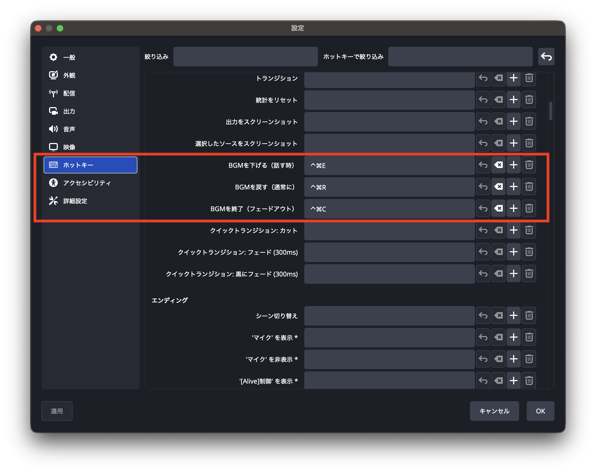

# 🎵 BGMフェーダー

配信中のBGM音量をホットキーで素早く調整できるスクリプトです。話す時は音量を下げ、通常時に戻す、さらに配信終了時にスムーズにフェードアウトさせることができます。

## 🔧 インストール方法

1. [`bgm-fader-filter.lua`](https://raw.githubusercontent.com/pepabo/alive-project-obs-plugins/main/scripts/bgm-fader-filter/bgm-fader-filter.lua)をダウンロード

    - リンクを右クリックして、「リンク先を別名で保存」を選択するとダウンロードできます。

2. OBSメニューの「ツール」→「スクリプト」を選択
3. 「+」ボタンをクリックし、ダウンロードした「bgm-fader-filter.lua」を選択
4. スクリプトの設定画面（下図）で各種パラメータを調整

## 🎬 使用方法

1. BGM音量の調整はホットキー（ショートカットキー）によって行います
2. OBSメニューの「設定」→「ホットキー」を選択（下図の赤枠の箇所）
3. 以下のホットキーにお好みのキーを割り当て
   - **BGMを下げる（話す時）**: 話す時にBGMを下げる
   - **BGMを戻す（通常に）**: 通常の音量に戻す
   - **BGMを終了（フェードアウト）**: 配信終了時にフェードアウト

## ⚙️ 設定項目

| 項目                          | 説明                           | 範囲         |
| ----------------------------- | ------------------------------ | ------------ |
| 音声ソース名                  | 制御対象のBGMソース名          | テキスト     |
| 話している間の音量 (dB)       | トーク中に下げる音量レベル     | -60 ～ 0     |
| 通常の音量 (dB)               | 通常時のBGM音量レベル          | -60 ～ 0     |
| 下げる時間 (ms)               | 音量を下げる際のフェード時間   | 50 ～ 2000   |
| 戻す時間 (ms)                 | 音量を戻す際のフェード時間     | 50 ～ 5000   |
| 終了フェードアウトの時間 (ms) | 配信終了時のフェードアウト時間 | 100 ～ 20000 |

### デフォルト値

- 話している間の音量: -40 dB
- 通常の音量: -20 dB
- 下げる時間: 200 ms
- 戻す時間: 600 ms
- 終了フェードアウト時間: 5000 ms (5秒)

## 💡 活用例

- **トーク配信**: 話す時にBGMを自動的に下げて、声を聞き取りやすく
- **ゲーム配信**: 重要なシーンでBGMを下げて、ゲーム音を強調
- **配信終了**: スムーズなフェードアウトで、プロフェッショナルな印象を演出
- **ラジオ配信**: DJのように自在にBGM音量をコントロール

## 🎯 使い方のコツ

1. **ソース名の設定**: BGMの音声ソース名を正確に設定してください（デフォルトは「BGM」）
2. **音量バランス**: 話している間の音量と通常の音量の差を調整して、最適なバランスを見つけましょう
3. **フェード時間**: 下げる時間は短め、戻す時間は長めにすると自然な印象になります
4. **ホットキー配置**: よく使うキー（例: F1, F2など）に割り当てると便利です

## ライセンス

このソフトウェアはMITライセンスのもとで公開されています。利用に際して生じたいかなる問題についても、開発元は一切の責任を負いません。詳しくは[LICENSE](../../LICENSE)をご確認ください。

## 🎯 提供

© 2025 GMO Pepabo, Inc. All rights reserved.

