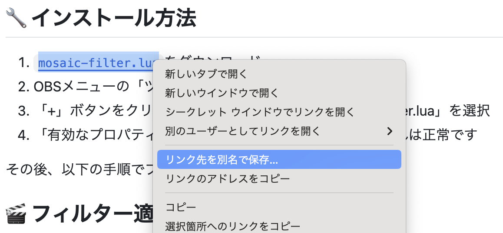

# 🎨 モザイクフィルター

シンプルな操作で映像にモザイクをかけることができるフィルターです。プライバシー保護や演出に最適です。

## 🎥 使用例

## 🔧 インストール方法

1. [`mosaic-filter.lua`](https://raw.githubusercontent.com/pepabo/alive-project-obs-plugins/main/scripts/mosaic-filter/mosaic-filter.lua)をダウンロード
    

ダウンロード方法

    - リンクを右クリックして、「リンク先を別名で保存」を選択するとダウンロードできます。
    
    
 

2. OBSメニューの「ツール」→「スクリプト」を選択
3. 「+」ボタンをクリックし、ダウンロードした「mosaic-filter.lua」を選択
4. 「有効なプロパティがありません」と表示されますが、これは正常です

その後、以下の手順でフィルターを適用できます：

## 🎬 フィルター適用方法

1. シーンまたはソースを右クリック→「フィルター」を選択
2. 「+」ボタンをクリック→「モザイク」を選択

## ⚙️ 設定項目

| 項目           | 説明                   | 範囲  |
| -------------- | ---------------------- | ----- |
| モザイクサイズ | モザイクの大きさを調整 | 1-100 |

## 💡 活用例

- プライバシー保護に
- レトロゲーム風の表現に
- 画面の一部を隠すのに

## 📝 ライセンス

このソフトウェアはMITライセンスのもとで公開されています。利用に際して生じたいかなる問題についても、開発元は一切の責任を負いません。詳しくは[LICENSE](../../LICENSE)をご確認ください。

## 🎯 提供

© 2025 GMO Pepabo, Inc. All rights reserved.